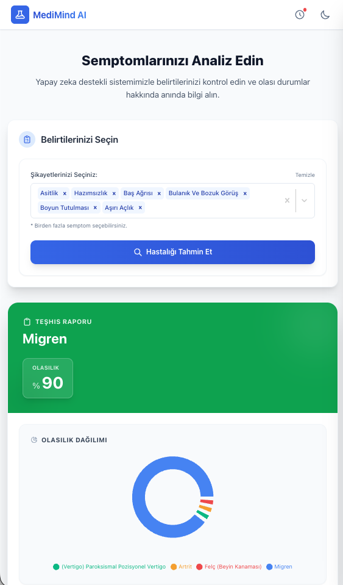
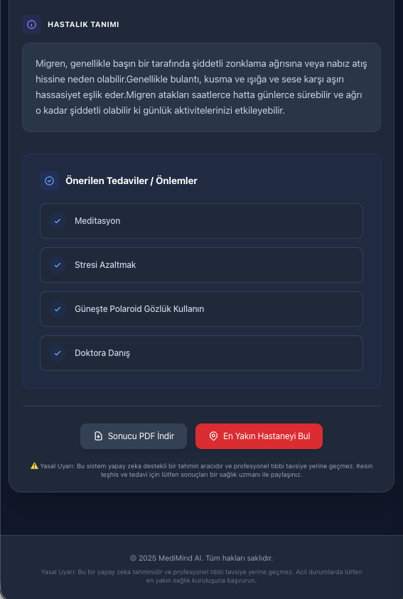
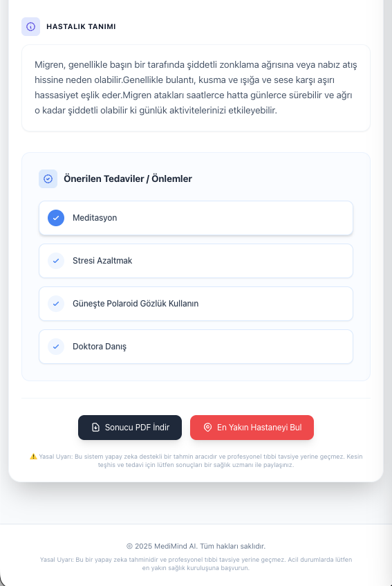

# MediMind AI - Yapay Zeka Destekli Sağlık Asistanı ❤️

MediMind AI, kullanıcıların semptomlarını analiz ederek olası hastalıkları tahmin eden, detaylı sağlık raporları sunan ve modern web teknolojileriyle donatılmış kapsamlı bir sağlık asistanıdır.


## 🌟 Proje Hakkında

MediMind AI, makine öğrenimi algoritmalarını modern bir web arayüzü ile birleştirerek sağlık okuryazarlığını artırmayı hedefler. Kullanıcı dostu arayüzü, **İnteraktif Vücut Haritası**, **Karanlık Mod** desteği ve **Türkçe** içerik yapısıyla herkesin kolayca kullanabileceği bir araçtır.

## 📸 Ekran Görüntüleri

Uygulama, sistem tercihinize duyarlı **Aydınlık** ve **Karanlık** mod seçenekleri sunar.

### 🌓 Ana Sayfa ve Semptom Analizi
Kullanıcılar semptomlarını arama çubuğundan veya interaktif vücut haritası üzerinden seçebilirler.

| Aydınlık Mod (Light Mode) | Karanlık Mod (Dark Mode) |
|:-------------------------:|:------------------------:|
|  |  |

### 📋 Teşhis Sonuçları ve Raporlama
Yapay zeka analizi sonrası detaylı hastalık tanımı, olasılık grafiği ve önerilen tedaviler sunulur.

| Aydınlık Mod (Light Mode) | Karanlık Mod (Dark Mode) |
|:-------------------------:|:------------------------:|
|  |  |

## ✨ Öne Çıkan Özellikler

*   **🤖 Gelişmiş Yapay Zeka:** Random Forest algoritması ile eğitilmiş, yüksek doğruluk oranına sahip tahmin modeli.
*   **🧍 İnteraktif Vücut Haritası:** Semptomları vücut bölgelerine göre (Baş, Göğüs, Karın, Uzuvlar vb.) filtreleyerek kolay seçim imkanı.
*   **📄 Profesyonel A4 Rapor:** Sonuçları, grafikleri ve yasal uyarıları içeren, çıktı almaya uygun A4 formatında PDF raporu oluşturma.
*   **🔄 Akıllı Geçmiş:** Geçmiş aramalarınızı kaydeder ve tıkladığınızda o analizdeki semptomları otomatik olarak forma geri yükler.
*   **🌙 Karanlık Mod (Dark Mode):** Göz yormayan, sistem tercihlerine duyarlı modern karanlık tema desteği.
*   **🏥 En Yakın Hastane:** Konum bazlı entegrasyon ile tek tıkla yakındaki sağlık kuruluşlarını listeler.
*   **🇹🇷 Tam Türkçe Destek:** Hastalık isimleri, tanımlar, önlemler ve arayüz tamamen Türkçeleştirilmiştir.
*   **📱 Responsive Tasarım:** Mobil, tablet ve masaüstü cihazlarla tam uyumlu modern arayüz.

## 🛠️ Kullanılan Teknolojiler

### Backend (Python & FastAPI)
*   **FastAPI:** Yüksek performanslı, asenkron API servisi.
*   **Scikit-learn:** Makine öğrenimi modeli (Random Forest Classifier).
*   **Pandas & NumPy:** Veri işleme ve manipülasyon.
*   **Joblib:** Model serileştirme.

### Frontend (React & Tailwind)
*   **React.js:** Bileşen tabanlı modern kullanıcı arayüzü.
*   **Tailwind CSS:** Responsive ve özelleştirilebilir stil yönetimi.
*   **Recharts:** Veri görselleştirme (Pasta Grafiği).
*   **JSPDF & HTML2Canvas:** İstemci tarafında yüksek kaliteli PDF oluşturma.
*   **React Select:** Gelişmiş, aranabilir çoklu seçim bileşeni.

## 📂 Proje Yapısı

```bash
MediMind-AI/
├── backend/
│   ├── app/
│   │   ├── main.py            # API Endpoints ve Uygulama
│   │   └── ...
│   ├── data/                  # Veri setleri (CSV/JSON)
│   ├── models/                # Eğitilmiş .joblib modelleri
│   ├── train_model.py         # Model eğitim scripti
│   └── translate_assets.py    # Çeviri scripti
│
├── frontend/
│   ├── src/
│   │   ├── components/        # ResultCard, SymptomForm, BodyMap vb.
│   │   ├── utils/             # Yardımcı fonksiyonlar ve mappingler
│   │   ├── App.js             # Ana uygulama mantığı
│   │   └── ...
│   └── public/
│       └── logo.svg           # Uygulama logosu
│
└── screenshots/               # Proje görselleri
```

## 🚀 Kurulum ve Çalıştırma

Projeyi yerel ortamınızda çalıştırmak için aşağıdaki adımları izleyin.

### Gereksinimler
*   Python 3.8 veya üzeri
*   Node.js ve npm

### 1. Backend Kurulumu

Terminali açın ve `backend` klasörüne gidin:

```bash
cd backend
```

Gerekli Python kütüphanelerini yükleyin:

```bash
pip3 install -r requirements.txt
```

Modeli eğitin ve gerekli dosyaları oluşturun:

```bash
python3 train_model.py
python3 translate_assets.py
```

Sunucuyu başlatın:

```bash
uvicorn app.main:app --reload
```
Backend `http://localhost:8000` adresinde çalışacaktır.

### 2. Frontend Kurulumu

Yeni bir terminal açın ve `frontend` klasörüne gidin:

```bash
cd frontend
```

Gerekli paketleri yükleyin:

```bash
npm install
```

Uygulamayı başlatın:

```bash
npm start
```
Uygulama `http://localhost:3000` adresinde açılacaktır.

## 📊 Veri Seti

Bu projede kullanılan veri seti için teşekkürler: [Disease Symptom Prediction](https://www.kaggle.com/datasets/itachi9604/disease-symptom-description-dataset)

## ⚠️ Yasal Uyarı

Bu proje **sadece eğitim ve bilgilendirme amaçlıdır**. Sunulan sonuçlar kesin tıbbi teşhis niteliği taşımaz. Sağlık sorunlarınız için lütfen uzman bir hekime başvurunuz.

---

**Geliştirici:** Umut Yavuz
**Lisans:** MIT
